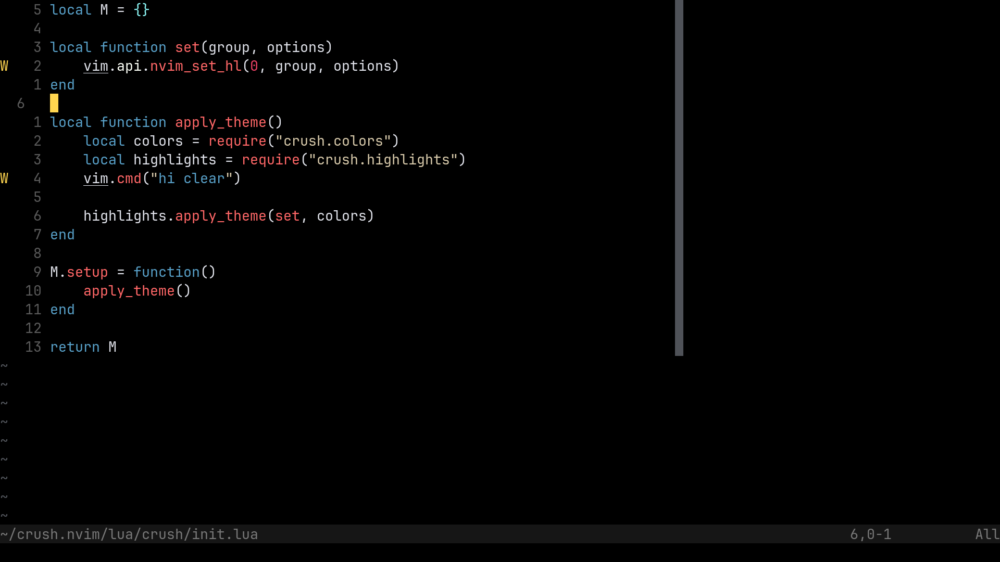

THIS SHIT IS WRITTEN BY CHATGPT

# 🌸 Crush.nvim



This is a custom Neovim color scheme that provides a clean and minimalistic look with vibrant colors for improved readability and style. It's designed to be easy on the eyes while maintaining high contrast, making it suitable for long coding sessions.

Colors

The color palette is defined as follows:

Background (bg): #000000 — Dark background for a sleek, modern look.

Foreground (fg): #FCFFF7 — Light, off-white text for readability.

Comment: #767676 — Muted grey for comments.

Keyword: #58A0C8 — Soft blue for keywords like if, for, etc.

String: #D7C9AA — Light beige for string literals.

Function: #FF6767 — Red for function names.

Type: #0496ff — Bright blue for types like int, string, etc.

Number: #EE4266 — Bold pink for numbers.

Constant: #D49A1A — Golden color for constants.

Error: #E57373 — Soft red for error messages.

Warning: #FFD54F — Yellow for warnings.

Info: #4FC1FF — Light cyan for informational messages.

Cursorline: #1e1e1e — Darker background for the cursor line.

Line Number (linenr): #5A5A5A — Subtle gray for line numbers.

Cursor Line Number (cursorlnr): #7A7A7A — Slightly lighter gray for the cursor line number.

Selection: #3A5F8A — Deep blue for selected text.

## 📦 Installation

### Using [lazy.nvim](https://github.com/folke/lazy.nvim)

```lua
{
    "Prince-Ramani/crush.nvim",
    config = function()
    require("crush").setup({
    })
    vim.cmd.colorscheme("crush")
  end,
}
```

### Using [packer.nvim](https://github.com/wbthomason/packer.nvim)

```lua
use {
    "Prince-Ramani/crush.nvim",
    config = function()
    require("crush").setup({
    })
    vim.cmd.colorscheme("crush")
  end,
}
```

Usage

Once installed, you can activate the theme by adding the following to your init.lua:

vim.cmd('colorscheme crush')
