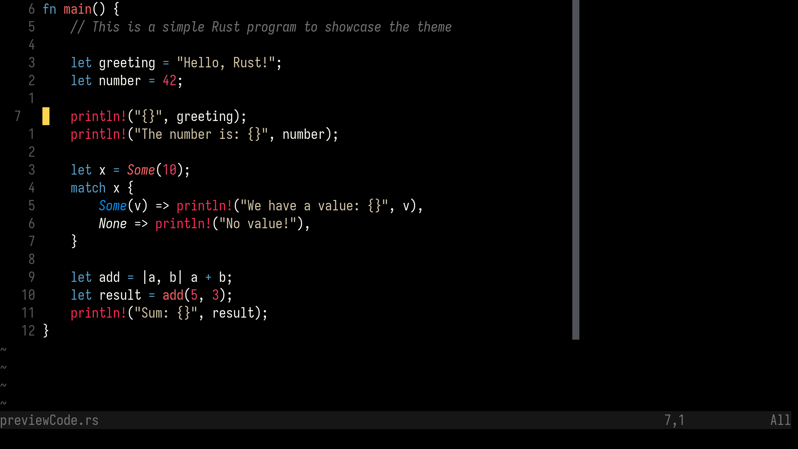
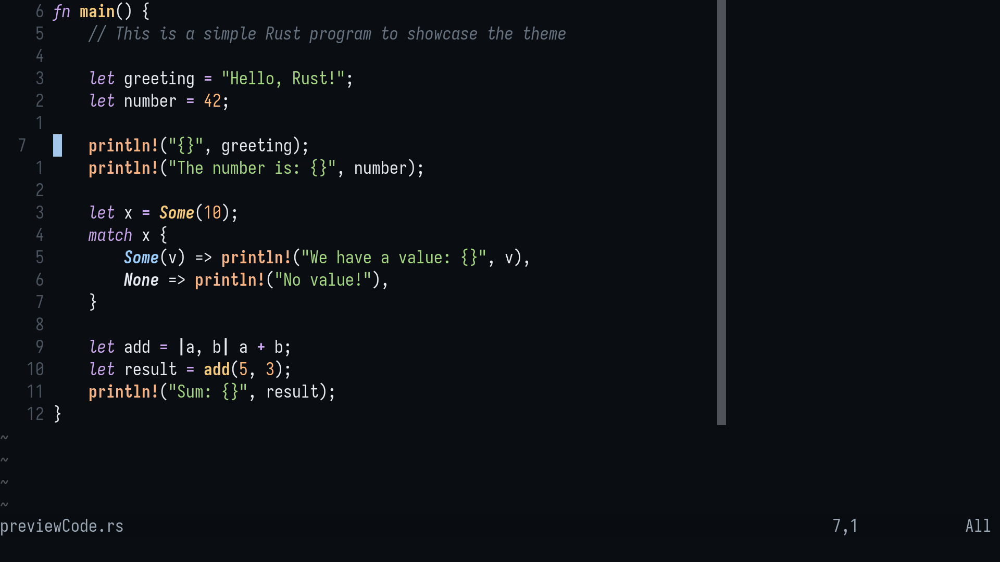

# 🌸 Crush.nvim

**Crush.nvim** is a custom Neovim colorscheme focused on a **clean, minimal**, and **vibrant aesthetic**. Designed with long coding sessions in mind, it balances **high contrast** and **soft tones** to reduce eye strain while maintaining visual clarity.

---

## 🎨 Color Variants

Crush.nvim includes **two beautiful variants**:

---

### 💥 Crush (Dark Theme)

A sharp, modern **dark theme** with bright accents and smooth contrasts.



| Element       | Color Name  | Hex       |
| ------------- | ----------- | --------- |
| Background    | Dark Black  | `#000000` |
| Foreground    | Soft White  | `#FCFFF7` |
| Comment       | Muted Gray  | `#767676` |
| Keyword       | Soft Blue   | `#58A0C8` |
| String        | Light Beige | `#D7C9AA` |
| Function      | Soft Red    | `#FF6767` |
| Type          | Bright Blue | `#0496FF` |
| Number        | Bold Pink   | `#EE4266` |
| Constant      | Gold        | `#D49A1A` |
| Error         | Light Red   | `#E57373` |
| Warning       | Yellow      | `#FFD54F` |
| Info          | Cyan        | `#4FC1FF` |
| Cursor Line   | Dim Gray    | `#1E1E1E` |
| Line Number   | Gutter Gray | `#5A5A5A` |
| Current Line# | Light Gray  | `#7A7A7A` |
| Selection     | Deep Blue   | `#3A5F8A` |
| Statusline BG | Graphite    | `#161616` |
| Statusline FG | Gray        | `#777777` |
| Popup Menu BG | Dark Gray   | `#1E1E1E` |
| Dim BG        | Soft Black  | `#0A0A0A` |
| FZF Match     | Neon Pink   | `#FF5F87` |

---

### 🌼 Blossom (Dark purple-blue Theme)

A minimal and elegant variant with soft tones and a cooler visual aesthetic.



| Element       | Color Name    | Hex       |
| ------------- | ------------- | --------- |
| Background    | Black Russian | `#0F0326` |
| Foreground    | Mist Green    | `#CEDFD9` |
| Comment       | Gray          | `#767676` |
| Keyword       | Aqua Blue     | `#07A0C3` |
| String        | Blossom Pink  | `#F4ACB7` |
| Function      | Rose Red      | `#FF6767` |
| Type          | Sky Blue      | `#0496FF` |
| Number        | Mocha Brown   | `#994636` |
| Constant      | Amber Gold    | `#D49A1A` |
| Error         | Soft Red      | `#E57373` |
| Warning       | Lemon Yellow  | `#FFD54F` |
| Info          | Light Cyan    | `#4FC1FF` |
| Cursor Line   | Deep Gray     | `#1E1E1E` |
| Line Number   | Gutter Gray   | `#5A5A5A` |
| Current Line# | Light Gray    | `#7A7A7A` |
| Selection     | Slate Blue    | `#3A5F8A` |
| Statusline BG | Night Indigo  | `#0E103D` |
| Statusline FG | Gray          | `#777777` |
| Popup Menu BG | Midnight Blue | `#102E4A` |
| FZF Match     | Lilac Purple  | `#BC96E6` |

---

## 📦 Installation

### Using [lazy.nvim](https://github.com/folke/lazy.nvim)

```lua
{
  "Prince-Ramani/crush.nvim",
  config = function()
    vim.cmd.colorscheme("crush") -- crush, blossom
  end,
}
```

### Using [packer.nvim] (https://github.com/wbthomason/packer.nvim)

```lua
use {
    "Prince-Ramani/crush.nvim",
    config = function()
    vim.cmd.colorscheme("crush") -- crush, blossom
    end,
}
```

Once installed, you can activate the theme by adding the following to your init.lua:

vim.cmd('colorscheme crush')
OR
vim.cmd('colorscheme blossom')

## ✨ Extras

[You can also find Alacritty and Kitty configs for both style here.](./extras/)
