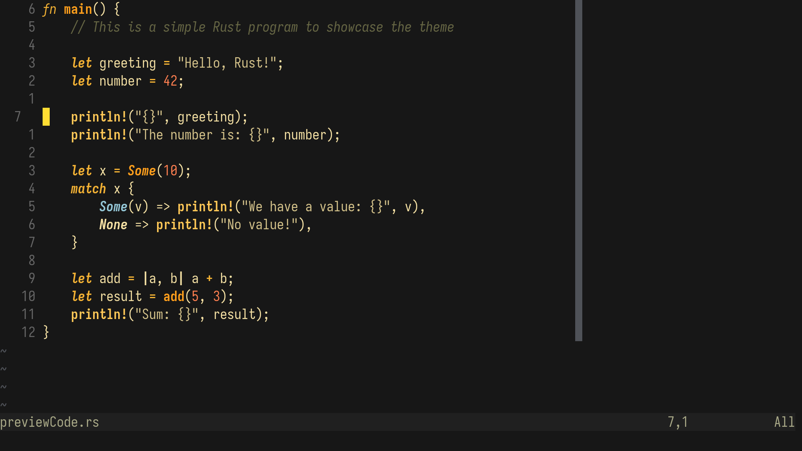
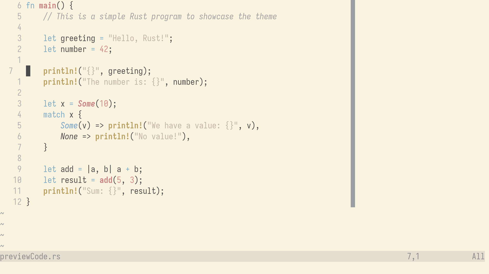

# 🌸 Crush.nvim

**Crush.nvim** is a minimal yet vibrant Neovim colorscheme collection, designed for focus, clarity, and long hours of coding. Each variant offers a distinct mood, from deep contrast to soft ambiance — all while staying easy on the eyes.

---

## 🎨 Themes

- **💥 Crush** – A dark theme with bold contrast and modern accents.
- **🌼 Blossom** – A softer, cooler variant with gentle purple and blue hues.
- **🐒 Monkeys** – A warm yellowish theme with energetic, sunny vibes and soft contrasts.
- **🎐 Furin** – Inspired by Japanese wind chimes; subtle, airy, and tranquil.

---

## 📸 Previews

> Click images to view full-size.

### 💥 Crush


---

### 🌼 Blossom


---

### 🐒 Monkeys



---

### 🎐 Furin



---

## 📦 Installation

### With [lazy.nvim](https://github.com/folke/lazy.nvim)

```lua
{
  "Prince-Ramani/crush.nvim",
  config = function()
    vim.cmd.colorscheme("crush") -- or "blossom","monkeys", "furin"
  end,
}
```

### Using [packer.nvim](https://github.com/wbthomason/packer.nvim)

```lua
use {
"Prince-Ramani/crush.nvim",
config = function()
vim.cmd.colorscheme("crush") -- or "blossom", "monkeys", "furin"
end,
}
```

Once installed, you can activate the theme by adding the following to your config:

vim.cmd('colorscheme crush')

OR

vim.cmd('colorscheme blossom')

OR

vim.cmd('colorscheme monkeys')

OR

vim.cmd('colorscheme furin')

### ✨ Extras

[You can also find Alacritty and Kitty configs for both style here.](./extras)
